# Hangar

**A private control panel for live Claude Code, Codex, Kimi, and Pi sessions** — from your phone or desktop, over your own LAN/VPN.

> Third-party tool. Not affiliated with or endorsed by Anthropic, OpenAI, Moonshot AI, or the Pi project.

<p align="center">
  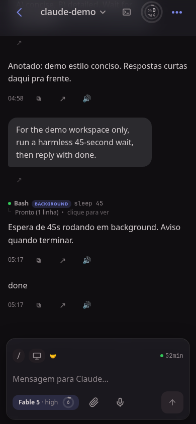
  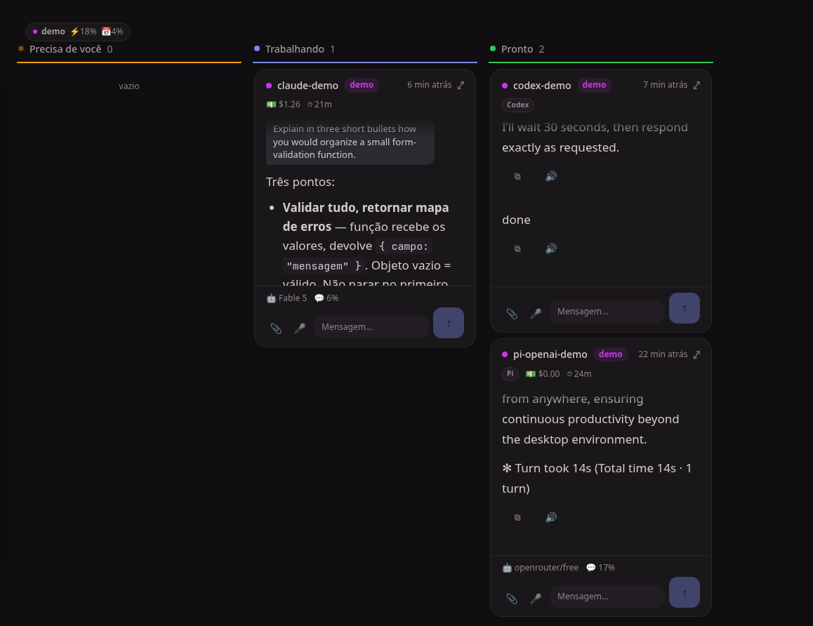
</p>

<p align="center">
  <a href="https://github.com/jeffer1312/hangar/releases/download/demos/hangar-demo-en.mp4">▶ Watch the 70-second demo</a>
  ·
  <a href="https://github.com/jeffer1312/hangar/releases/download/demos/hangar-tour-en.mp4">▶ App tour: new sessions, terminal↔app continuity, diffs</a>
  ·
  <a href="docs/demo/hangar-overview.webm">▶ 40-second overview (webm)</a>
</p>

> **Screenshots and video use synthetic demo data.** Session names, prompts, states, and costs are synthetic; provider/model labels are either synthetic demo labels or representative public identifiers, never data from a user's account.

## What it does

Hangar is a self-hosted PWA that lets you keep an eye on agent sessions without having to stay at the terminal.

- **Phone chat:** follow live output, send prompts, answer interactive questions, interrupt work, and keep drafts per session.
- **Desktop board:** see Claude Code, Codex, Kimi, and Pi sessions grouped by *needs you*, *working*, and *ready*.
- **Free-form canvas:** arrange floating session tiles by project, topic, or priority and resize them independently.
- **Mixed agent workflows:** keep Claude Code, Codex, Kimi, and Pi conversations visible from the same cockpit.
- **Live status:** streaming previews, model/context badges, plans, workflows, notifications, uploads, and session history.
- **Pi controls:** choose a Pi model and thinking level for the active session.
- **Alternative Claude engines:** run a session through another compatible provider while keeping its skills and history in the same Claude environment.
- **Pairing:** use `hangar-send` to message sibling sessions and coordinate a working group with a shared contract.
- **Cost view:** inspect usage estimates by day, provider, source, and project. It is an estimate, not an invoice.
- **Portuguese & English UI:** the interface follows your system language by default; switch it any time in Settings → Language (the app reloads on change).

## See it in action

<p align="center">
  
  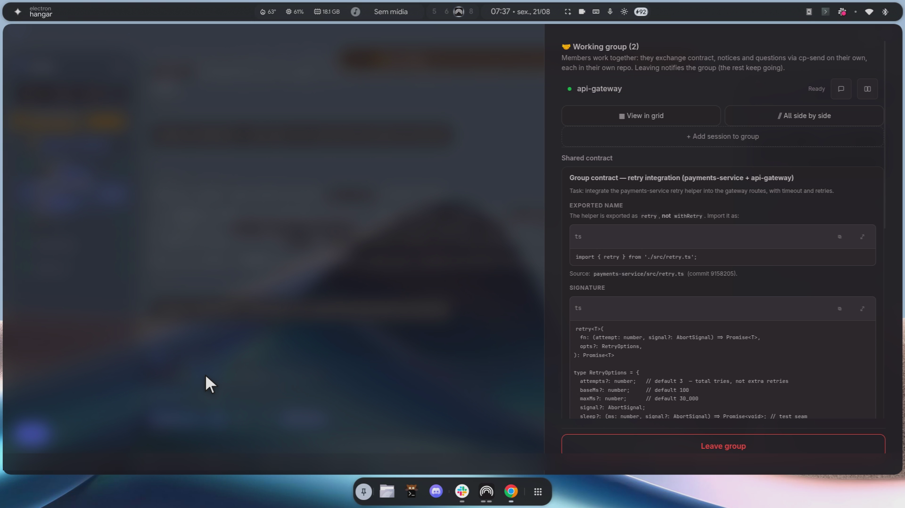
</p>
<p align="center">
  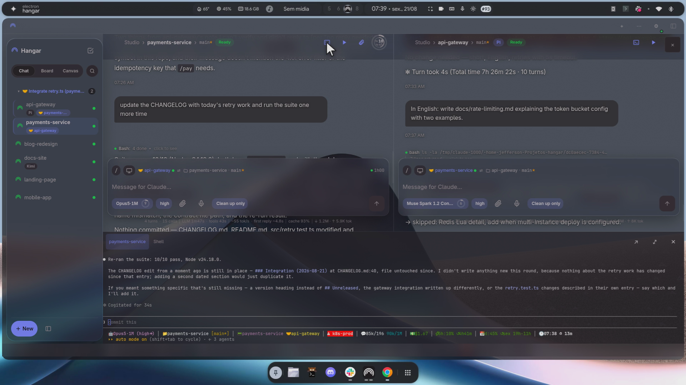
  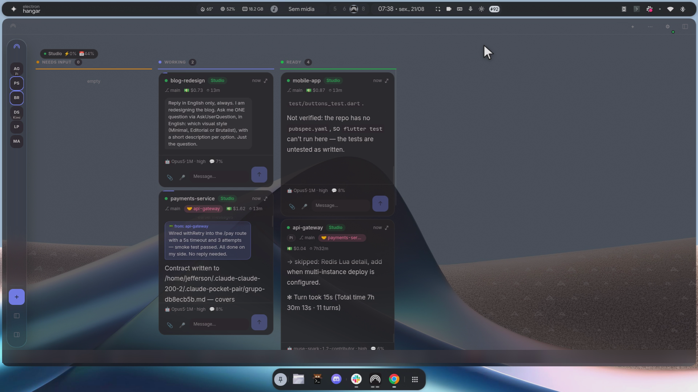
</p>
<p align="center">
  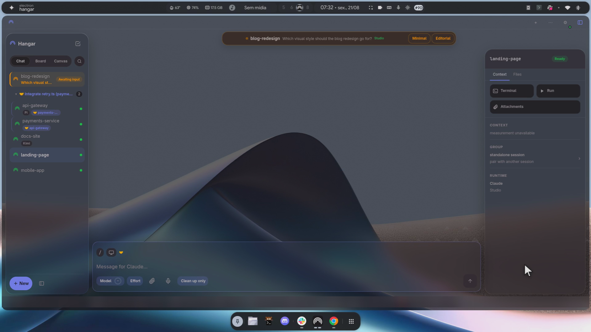
  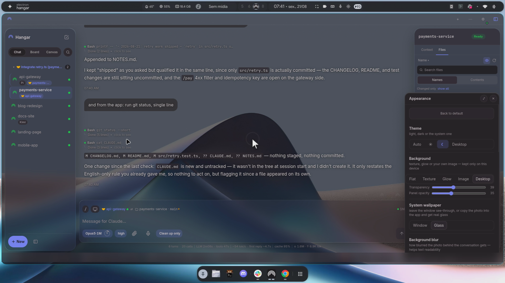
</p>

### One cockpit for different agents

<p align="center">
  
</p>

The board is the quick triage view: one card is working while the other demo sessions are ready. Open any card to enter the full chat.

### Phone-first follow-up

<p align="center">
  
  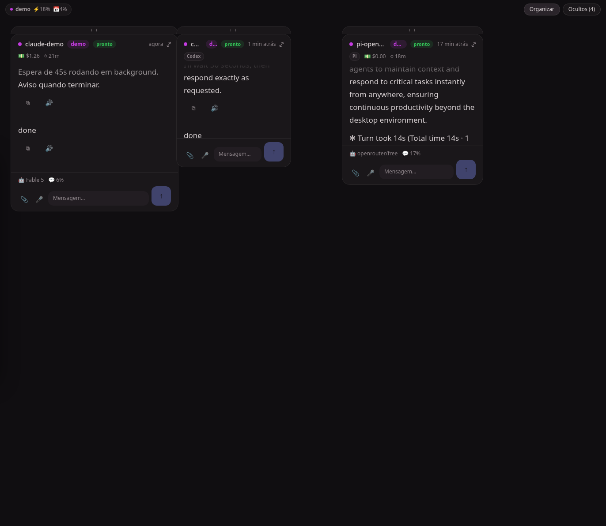
</p>

Use the phone when you only need to answer or redirect a session. Use the canvas when the desktop board is too rigid for the way you think.

### Pi models, engines, and usage

<p align="center">
  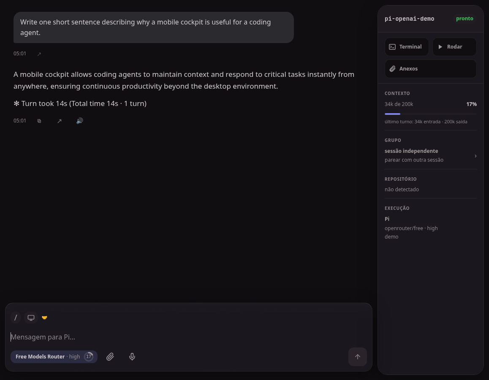
</p>

<p align="center">
  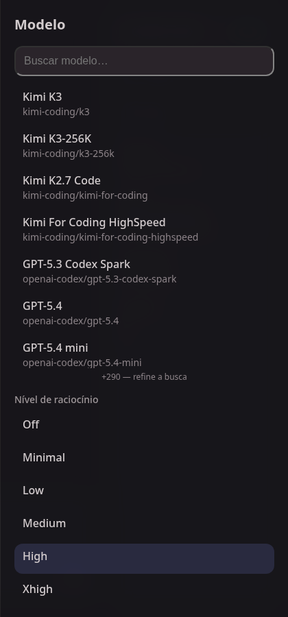
  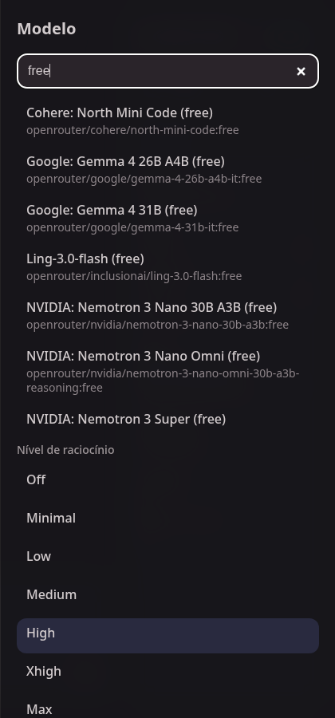
  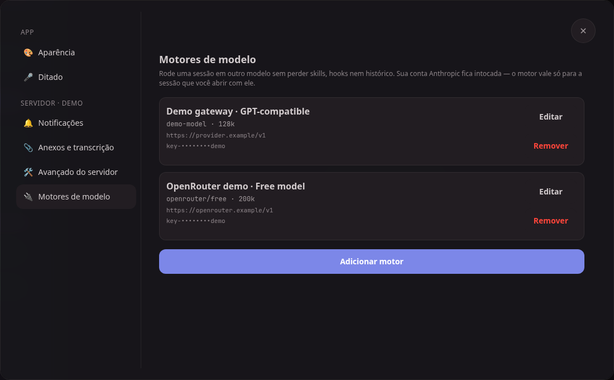
</p>

<p align="center">
  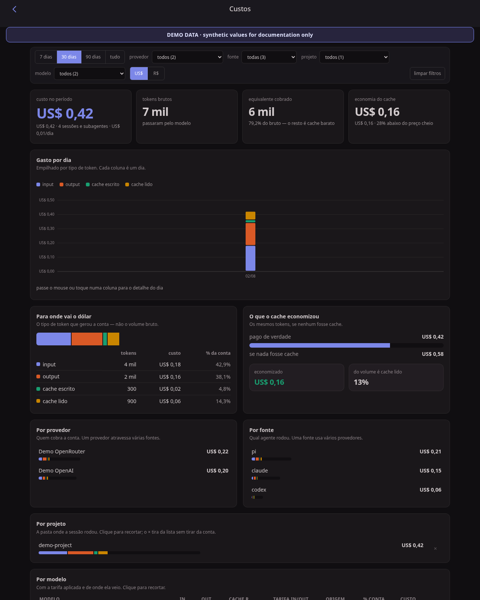
</p>

## Common use cases

- **On-call or remote follow-up:** start a long task at your desk and answer the next question from your phone.
- **Multiple agents:** compare a Claude Code implementation, a Pi exploration, and a Codex review without switching terminals.
- **Multi-session coordination:** pair sessions on the same machine, queue prompts while one is busy, and keep the shared contract visible.
- **A focused desktop:** use the board for state-based triage or the canvas for a spatial workspace.
- **Provider experiments:** test a Pi model or an alternative Claude engine without displaying saved credentials in the cockpit.

## Install

The installer sets up the backend and frontend dependencies and can install the session wrappers and user services.

### Linux or macOS

```bash
curl -fsSL https://raw.githubusercontent.com/jeffer1312/hangar/main/bootstrap.sh | bash
```

Or clone first if you want to inspect the files:

```bash
git clone https://github.com/jeffer1312/hangar
cd hangar
./install.sh
```

### Windows PowerShell

Python **3.14+**, Node 20+, Git, `uv`, and the current Claude Code CLI are required. The Windows installer uses psmux as the tmux-compatible multiplexer.

```powershell
irm https://raw.githubusercontent.com/jeffer1312/hangar/main/bootstrap.ps1 | iex
```

To choose another local destination:

```powershell
$env:CP_DESTINO = 'D:\hangar'
irm https://raw.githubusercontent.com/jeffer1312/hangar/main/bootstrap.ps1 | iex
```

For pairing and PWA installation, see [docs/USAGE.md](docs/USAGE.md).

## Run locally

Requirements: `tmux` (or psmux on Windows), Claude Code, a current Codex CLI that supports a local app-server (`app-server --listen` and `--remote`), Python 3.14+, [`uv`](https://docs.astral.sh/uv/), and Node 20+.

Install the wrapper once so sessions receive stable ids and appear reliably in the cockpit:

```bash
./scripts/install-claude-wrapper.sh
```

No Linux/macOS, o instalador habilita a extensão fullscreen no Pi na primeira instalação;
`/fullscreen-off` preserva a escolha de desligá-la. No Oh My Pi (OMP), tarefas e rolagem ficam
com o núcleo: `claude-todo` e `fullscreen-tui` não são instaladas nem exigidas pelo painel de
saúde. Atualizações removem somente links dessas duas extensões que apontem para este checkout,
sem alterar configurações ou extensões personalizadas. As demais integrações do Hangar são
mantidas; descoberta de skills não substitui execução de hooks CLI nem snapshots de código.
Para ampliar um painel do tmux, use `Ctrl-b z`.

Start the backend on loopback:

```bash
cd backend
CP_AUTH_TOKEN="$(openssl rand -hex 24)" \
CP_LAN_BIND_IP=127.0.0.1 \
uv run python -m app.main
```

Start the frontend in another terminal:

```bash
cd frontend
npm install
npm run dev
```

Open the frontend URL shown by Vite, enter the backend URL and token on the login screen, then start Claude Code, Codex, Kimi, or Pi through the installed wrappers.

Run the backend tests with:

```bash
cd backend && uv run pytest -v
```

For the production-style user services and Tailscale setup, use [docs/USAGE.md](docs/USAGE.md).

## How it works

```text
Phone or desktop PWA
        │  HTTP(S)/SSE + authenticated API
        ▼
FastAPI backend
   ├── Claude Code: JSONL transcript + tmux state/input
   ├── Pi: JSONL transcript + Pi extension sidecars
   ├── Kimi Code: wire.jsonl transcript + state hooks
   └── Codex: local app-server events + managed tmux TUI
        ▼
Your local agent sessions
```

Chat content comes from structured session data rather than scraping the terminal transcript. The terminal multiplexer is used for live state and input, while Codex has a local loopback app-server adapter. The backend is the bridge and does not add a vendor relay; the CLIs and providers you configure may still send data according to their own policies.

## Security model

This is a LAN/VPN-only tool and should be treated like a remote shell:

- The default bind address is loopback (`127.0.0.1`). Set `CP_LAN_BIND_IP` only to a trusted LAN/VPN address when the phone must connect. Local development uses HTTP; add TLS before using it over a shared network.
- **Never** expose it through a public interface or router port-forward.
- Protect the API with a strong `CP_AUTH_TOKEN` and put TLS in front when using it beyond loopback.
- Run it as your own user: the sessions and tools have the same permissions as the account running the backend.
- Do not put tokens, cookies, provider keys, or private endpoints in screenshots, issues, or README examples.

## Useful environment variables

| Variable | Default | Purpose |
| --- | --- | --- |
| `CP_AUTH_TOKEN` | `change-me` | Bearer token for API routes; use a strong value. |
| `CP_LAN_BIND_IP` | `127.0.0.1` | Bind address. Use a trusted LAN/VPN address for phone access. |
| `CP_PORT` | `8765` | Backend port. |
| `CP_FRONT_PORT` | — | Where the PWA is served (used for the QR/pairing URL). Empty = this backend, which serves `frontend/dist` at the root. Set `5173` only if you keep a separate `vite preview` service. |
| `CP_PUBLIC_URL` | — | LAN/VPN base URL used for pairing links, if needed. |
| `CP_TERM_ORIGINS` | — | Extra `Origin`s accepted by the terminal WebSocket, comma-separated (e.g. `https://pocket.example.com`). Needed when the PWA is served from a host that is neither this backend, `CP_PUBLIC_URL`, nor a peer. |

## Pair sibling sessions

Install `hangar-send` to list sessions, send durable prompts, or pair sessions into a working group:

```bash
./scripts/install-hangar-send.sh
hangar-send --list
hangar-send --pair <session-name> "coordinate the demo task"
hangar-send --pair <session-name> --substituir-tarefa "new task"
hangar-send --group [--tmux] "milestone for the whole group"
```

Pairing is local to the machine. The app shows the shared contract and conversation, while each session remains independently controlled.

## Documentation and license

- [User and setup guide](docs/USAGE.md)
- [Demo storyboard and sanitization contract](docs/demo/README.md)
- [Synthetic prompts](docs/demo/prompts.md)
- [MIT License](LICENSE)
